# MushZm

MushZm is a cross platform React Native app for customer entry to the therapeutic use of psilocybin by providing 
information on published papers and companies involved in clinical trials, research and/or distribution.

The app features dosage/tolerance calculators, a marketplace, and customer profile. 

MongoDB is used to provide offline first back end functionality. 

	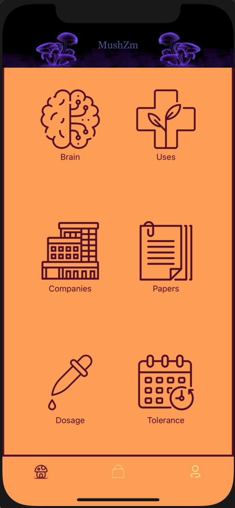
	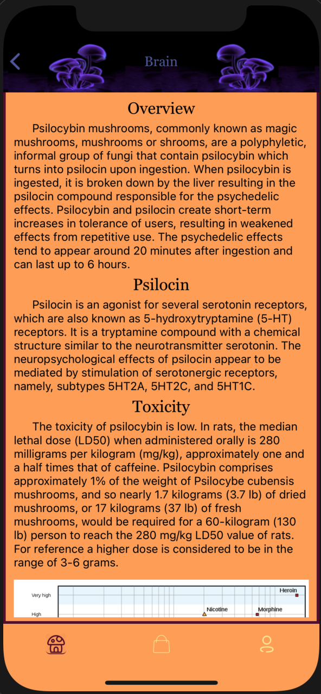
	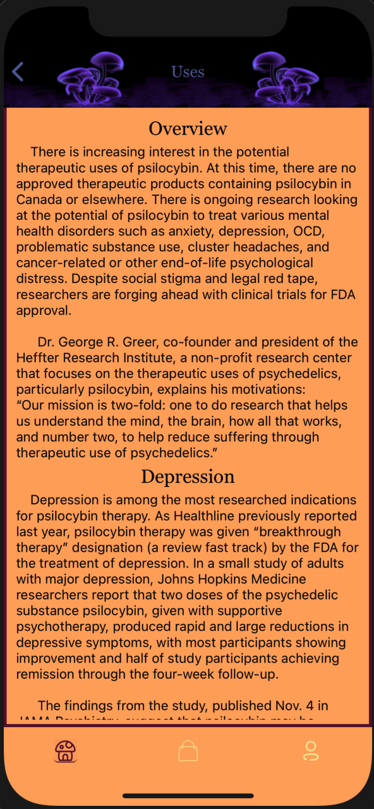
	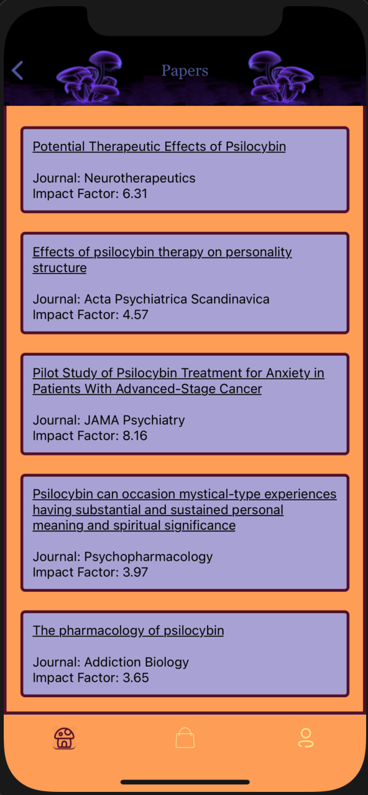
	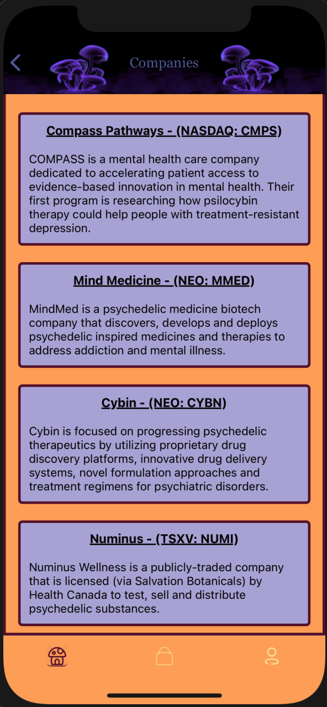
	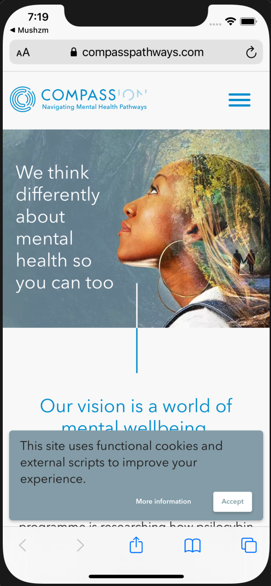
	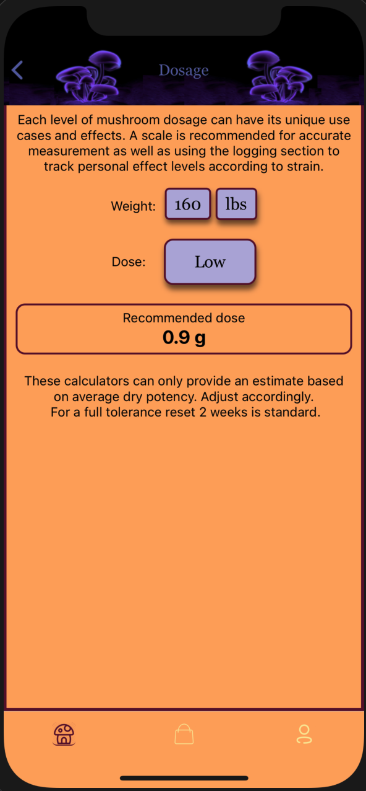
	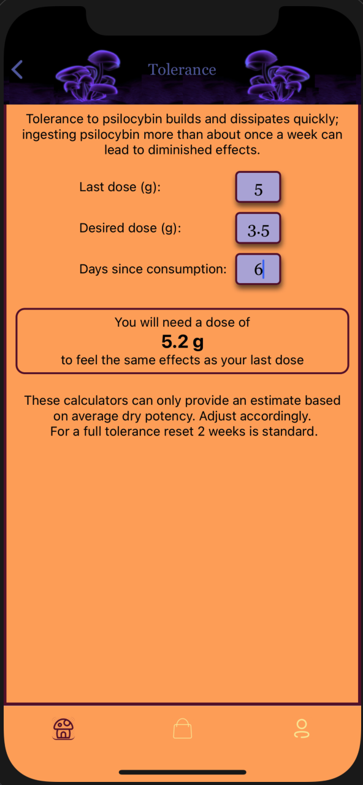
	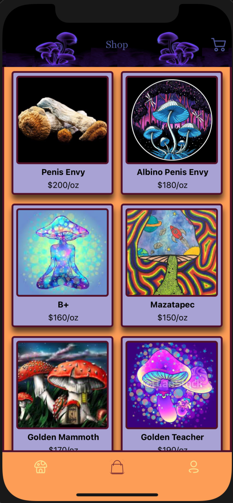
	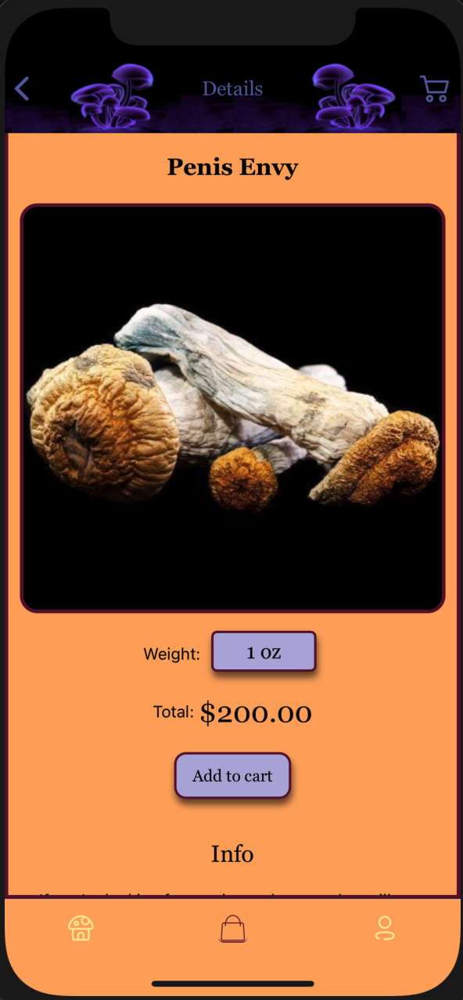
	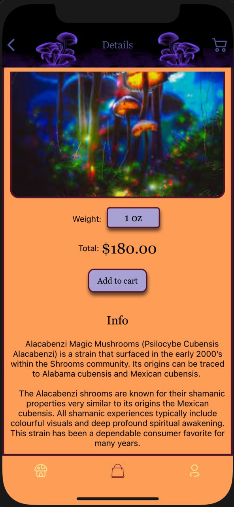
	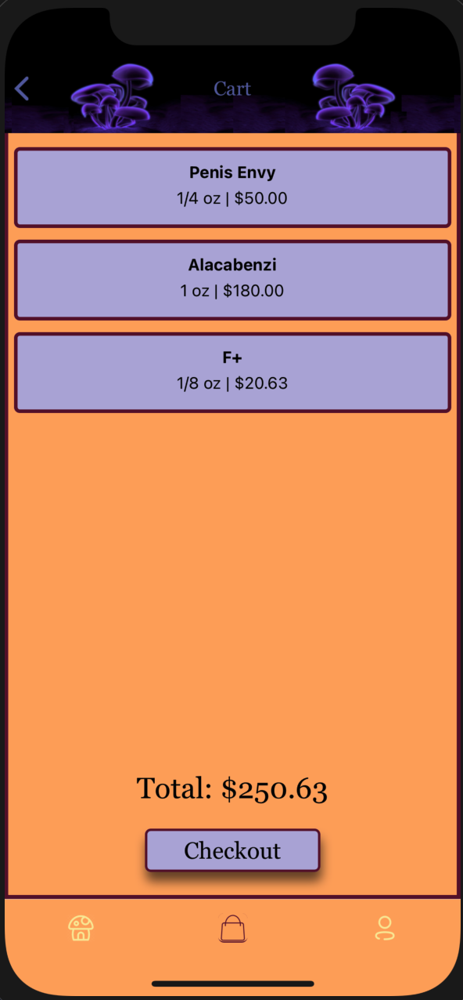
	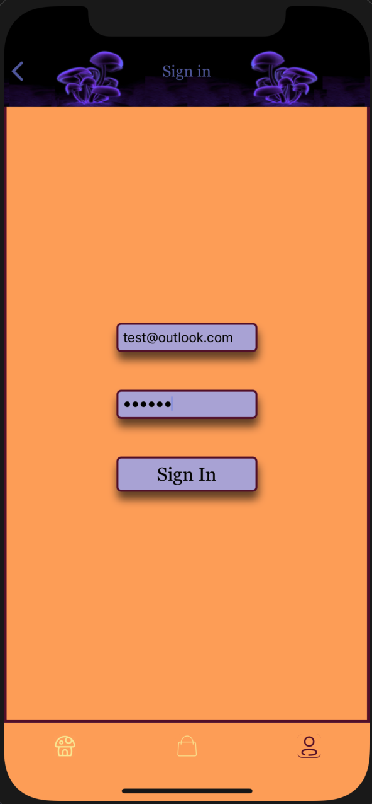
	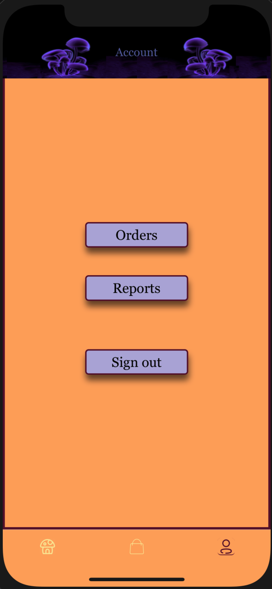
	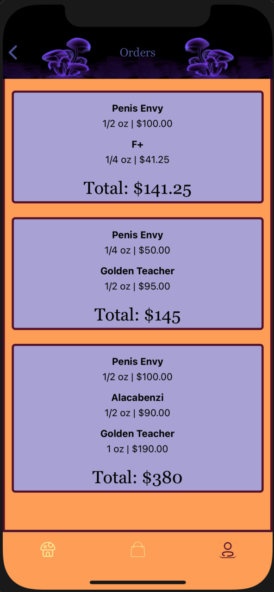
	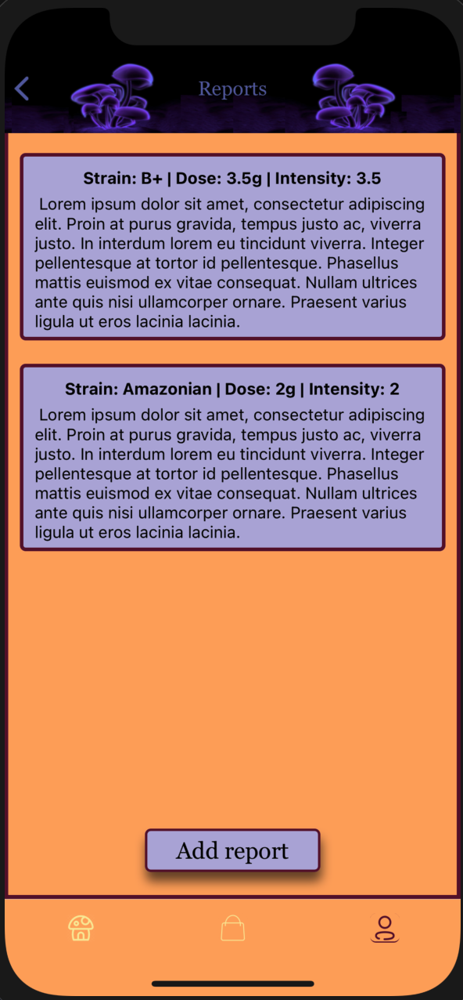
	

